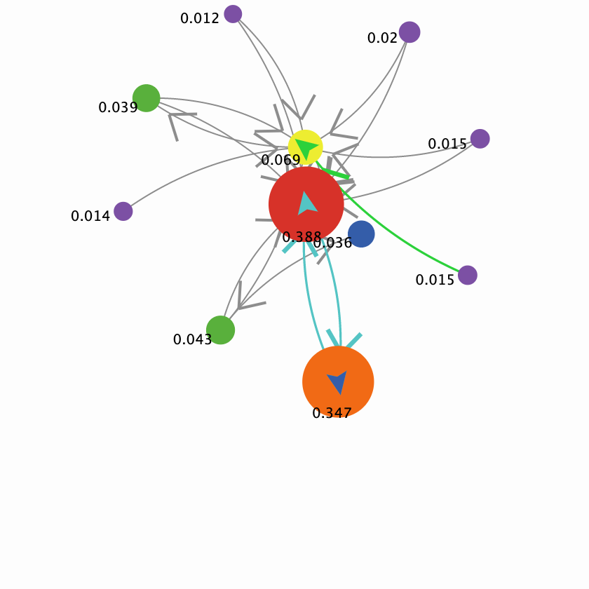
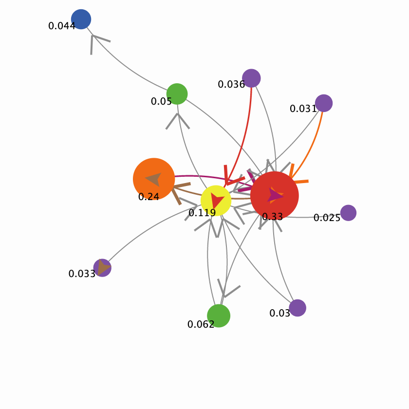
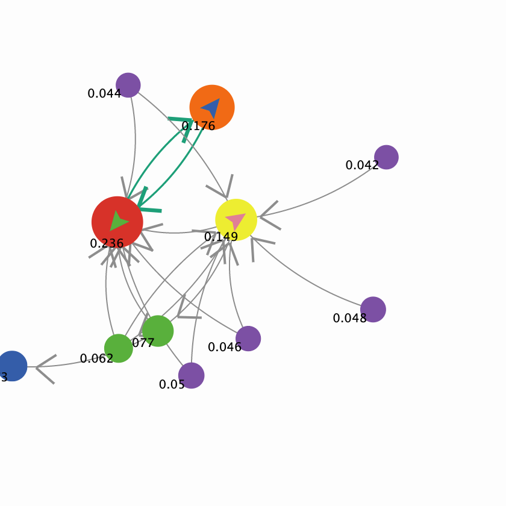
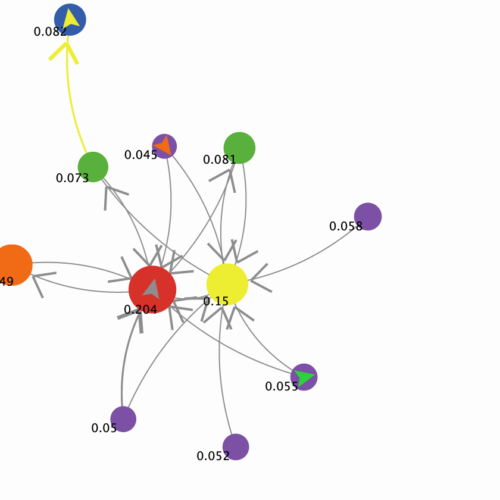
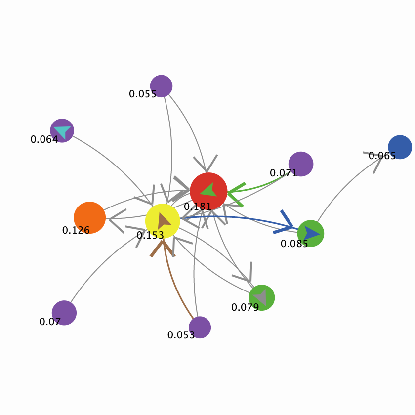
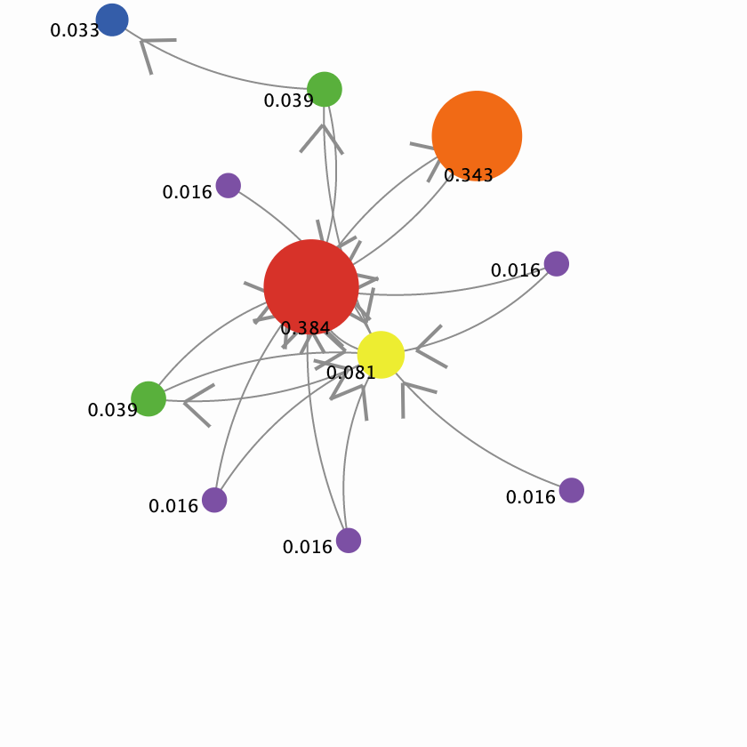
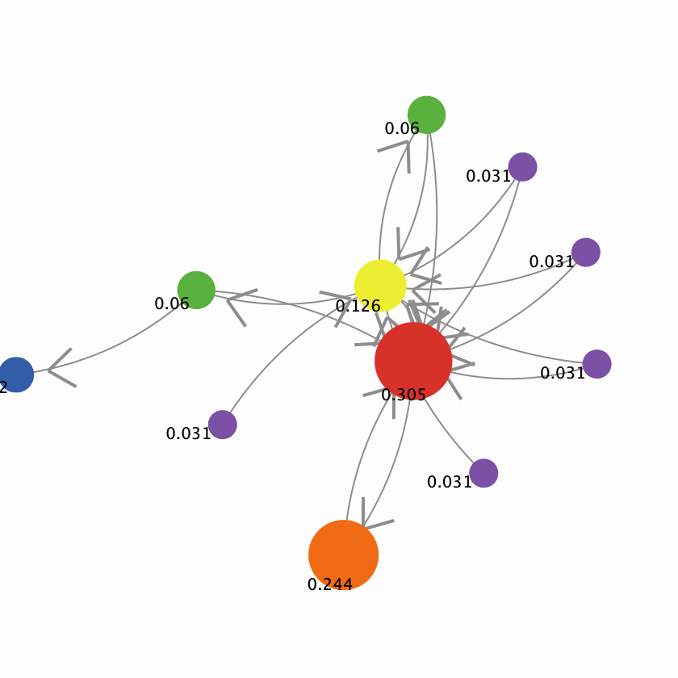
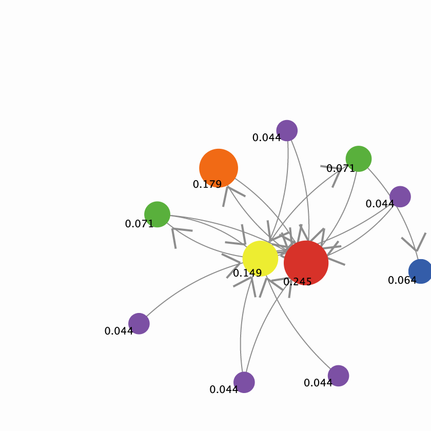
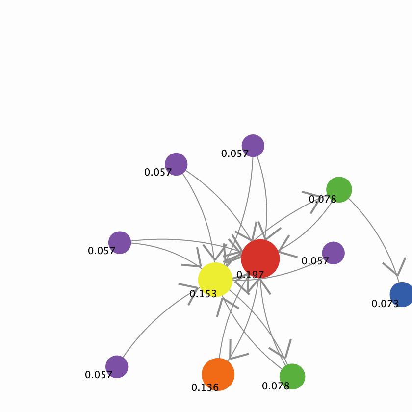
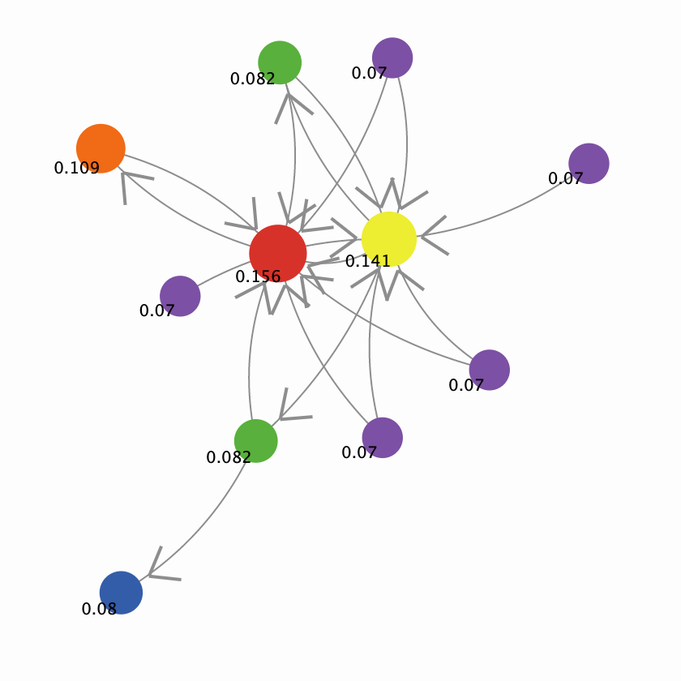

## Імітаційне моделювання комп'ютерних систем
## СПм-21-2, Бевзюк Роман Григорович
### Лабораторна робота №1. Опис імітаційних моделей
 

## Обрана модель в середовищі NetLogo:
[PageRank](http://www.netlogoweb.org/launch#http://www.netlogoweb.org/assets/modelslib/Sample%20Models/Computer%20Science/PageRank.nlogo)
 

### Вербальний опис моделі:
PageRank — це алгоритм/метрика, розроблена в Стенфордському університеті Ларрі Пейджем і Сергієм Бріном, які створили пошукову систему (і компанію) Google на основі цього методу. PageRank — це техніка ранжування релевантності веб-сторінок в Інтернеті за допомогою аналізу структури гіперпосилань, що об’єднує сторінки.

Ця модель демонструє два різні (хоча й пов’язані) методи на основі агентів для обчислення PageRank взаємопов’язаних веб-сторінок. Використання точки зору на основі агента намагається забезпечити глибше розуміння цього алгоритму та математики, що стоїть за ним.

Ранні веб-пошукові системи часто зосереджувалися на вмісті веб-сторінок, наприклад на відповідності відповідних ключових слів або слів, знайдених у тексті сторінки. PageRank, з іншого боку, зацікавлений у рейтингу сайтів на основі їх загальної корисності в Інтернеті (окрім будь-якого конкретного пошукового запиту чи теми). Оскільки Google використовує PageRank як один із компонентів своєї надзвичайно популярної пошукової системи в Інтернеті, можна легко помилково назвати PageRank пошуковим алгоритмом. Однак технічно це алгоритм ранжирування, який забезпечує ваги важливості для кожної сторінки в мережі. Однак ці рейтинги виявляються дуже корисними під час пошуку в Інтернеті, оскільки їх можна використовувати для визначення порядку, у якому результати пошуку відображаються користувачеві.

### Керуючі параметри:
- **network-choice** - мережа гіперпосилань, для якої потрібно розрахувати алгоритм PageRank.
- **damping-factor** - наскільки на значення рангу впливає виключно структура посилань.
- **calculation-method** - чи використовуватиме модель метод "випадкового перегляду" або "дифузії" для розрахунку PageRank.
- **number-of-surfers** - кількість роботів-серфінгу, які блукають інтернетом.
- **watch-surfers?** - якщо вимкнено, тоді будуть лише значення PageRank (і розміри вузлів), які змінюються з часом(оскільки відвідувачі приховані).
- **show-page-ranks?** - чи робити видимими цифри PageRank.

### Внутрішні параметри:
- **rank**. Поточний ранг(для дифузійного підходу)
- **new-rank**. Новий ранг(для дифузійного підходу)
- **visits**. Кількість відвідувань(для "випадкового" підходу)
- **current-page**. Поточна сторінка, на якій знаходиться робот-серфер
- **total-rank**. Сума рангів усіх сторінок
- **max-rank**. Максимальний ранг серед усіх сторінок

### Примітки:
Фактори, які треба враховувати при роботі з моделлю:
PageRank значною мірою залежить від однієї основної передумови про структуру всесвітньої павутини: веб-сторінки, які є більш корисними для людей, також будуть більш популярними, і, відповідно, матимуть більше гіперпосилань, які вказуватимуть на них з інших веб-сторінок.

Якщо це правда, дуже простим підходом до визначення того, які сайти є найбільш корисними/важливими, було б підрахувати кількість вхідних посилань на кожну сторінку та використовувати це як оцінку рейтингу. Однак це означало б припущення, що кожне посилання враховується однаково, що дуже неправильно. Одне посилання з важливого веб-сайту (наприклад, з yahoo.com або whitehouse.gov) має мати набагато більше значення, ніж посилання з якоїсь маловідомої сторінки, яка, ймовірно, нікого не цікавить. Таким чином, сторінка важлива, якщо їх багато (та/або важливі) сторінки посилаються на нього. Здається, це досить замкнуте визначення важливості, і виникає запитання: як ми можемо визначити, які сторінки важливі для початку?

PageRank вирішує цю проблему, спочатку класифікуючи всі сторінки як однаково важливі, але потім повторно виконує процес оцінки рейтингу сторінок, що призведе до зміни рейтингу важливості.

 

## Обчислювальні експерименти

### 1. Вплив **damping-factor** на метод "випадкового перегляду"

За ідеал візьмемо значення **damping-factor** - 85, при якому вважається, що ранги обчислюються найбільш правильно і підемо шляхом зниження. Від 80 до 25 із кроком 15 одиниць. Кожна симуляція тривалістю 200 тіків.

Інші параметри будуть фіксованими: 
- **number-of-surfers** - 5

**Test 1**

**Test 2**

**Test 3**

**Test 4**

**Test 5**

Можна зробити висновок, що при низькому значенні **damping-factor**, ранг обчислюється не зовсім коректно. Сайти на які немає посилань стають трохи менше в 2-3 рази "популярнішими" за відвідувані сайти. Що насправді означає, що якщо взяти нікому невідомий сайт – то він матиме такий ранг, як і сайт, у якого вже є певна база відвідувачів, хай і невелика.

### 2. Вплив **damping-factor** на метод "дифузії"

Все те саме як і при минулому експерименті, тільки інший підхід.

**Test 1**

**Test 2**

**Test 3**

**Test 4**

**Test 5**

Даний підхід був трохи точнішим, але все одно при низькому значенні **damping-factor**, ранг розраховується некоректно.

 