## Імітаційне моделювання комп'ютерних систем
## СПм-21-2, Бевзюк Роман Григорович
### Лабораторна робота №1. Опис імітаційних моделей
 

## Обрана модель в середовищі NetLogo:
[Painted Desert Challenge](http://www.netlogoweb.org/launch#http://www.netlogoweb.org/assets/modelslib/Sample%20Models/Computer%20Science/Painted%20Desert%20Challenge.nlogo)
 

### Вербальний опис моделі:
Painted Desert Challenge - модель базується на моделі Termites. У Termites агенти дотримуються набору простих правил, у результаті чого вони переміщують всю деревну стружку в одну купу. Painted Desert Challenge додає вимір кількох типів (кольорів) деревної стружки. Завдання полягає в тому, щоб змусити термітів сортувати кожен тип стружки у свою купу.

Кожен терміт починає блукати випадковим чином. Якщо він натрапляє на деревну стружку, він підбирає її та продовжує безладно блукати. Коли він натикається на іншу деревну стружку такого кольору, він знаходить порожнє місце неподалік і кладе свою стружку. Дотримуючись цих простих правил, деревна стружка зрештою потрапляє в купи, відсортовані за кольором.

### Керуючі параметри:
- **number** - кількість термітів.
- **density** - початкова щільність деревної стружки.
- **colors** - кількість різних типів стружки (кількість різних куп, які необхідно зробити).

### Внутрішні параметри:
- **chip?**. Наявність у терміту стружки потрібного типу
- **chip color**. Колір конкретного типу стружки

### Примітки:
Фактори, які треба враховувати при роботі з моделлю:\
Коли починають утворюватися купи деревної стружки, вони жодним чином не «захищені». Тобто терміти іноді забирають стружку з існуючих куп. Така стратегія може здатися контрпродуктивною. Але якби купи були «захищені», у вас було б багато маленьких купок, а не одна велика.

Загалом кількість куп з часом зменшується. Чому? Деякі купи зникають, коли терміти виносять всю стружку. І неможливо створити нову купу з нуля, оскільки терміти завжди кладуть свою деревну стружку поруч з іншою деревною стружкою. Отже, з часом кількість куп має зменшуватися. (Єдиний спосіб створення «нової» купи — це коли існуюча купа розділяється на дві частини.)

Як терміти знають, якого кольору стружку взяти? Ця модель призначає кожному терміту змінну, яка вказує, якого кольору чіп вибрати. 

Ця модель є хорошим прикладом «децентралізованої» стратегії. Немає жодного терміта, який відповідає за це, і немає спеціального заздалегідь визначеного місця для куп. Кожен терміт дотримується ряду простих правил, але колонія в цілому виконує досить складне завдання.

 

## Обчислювальні експерименти

### 1. Вплив кількості термітів на розподілення куп

Експеримент при **number** від 50 до 250 з кроком 50 одиниць. 

Інші параметри будуть фіксованими: 
- **density** - 45%
- **color** - 4

**Test 1**

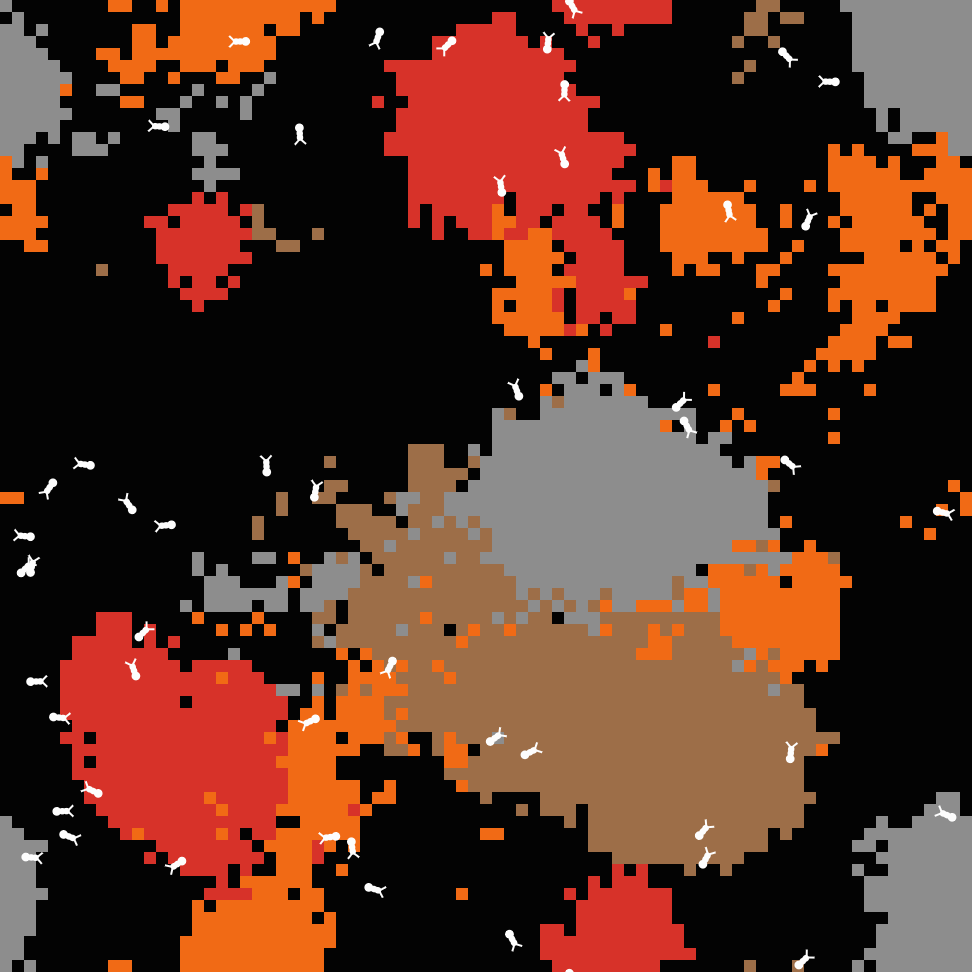

**Test 2**

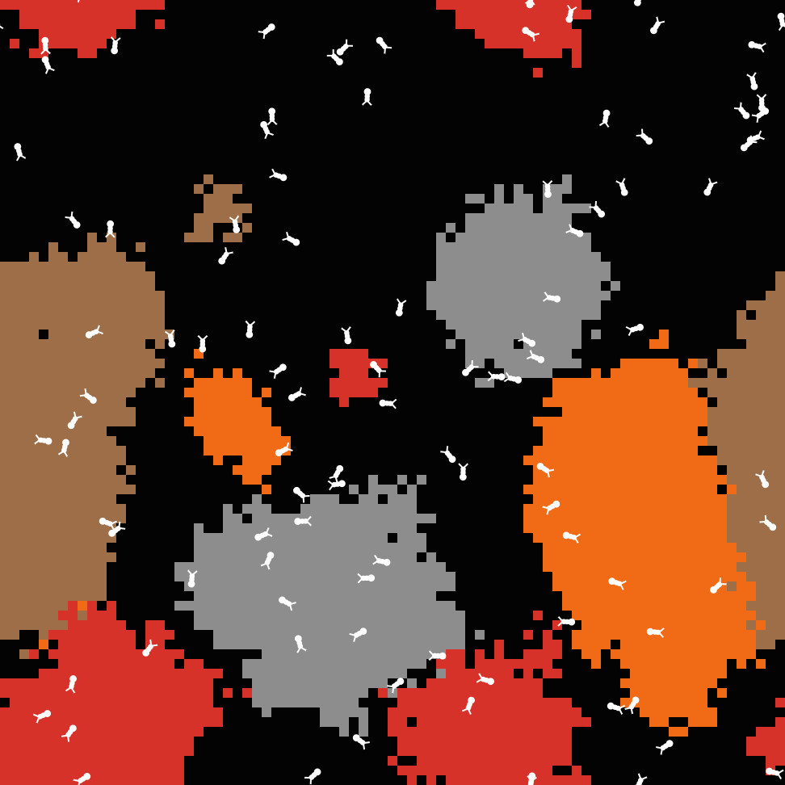

**Test 3**

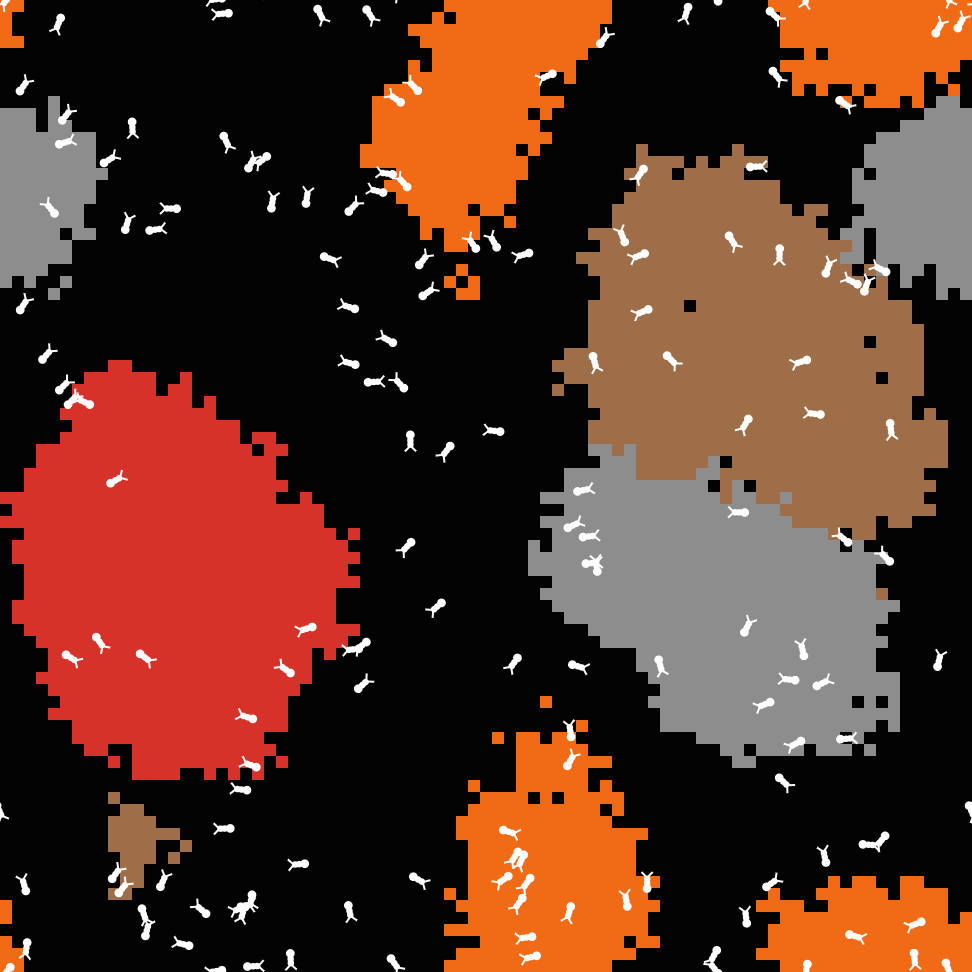

**Test 4**

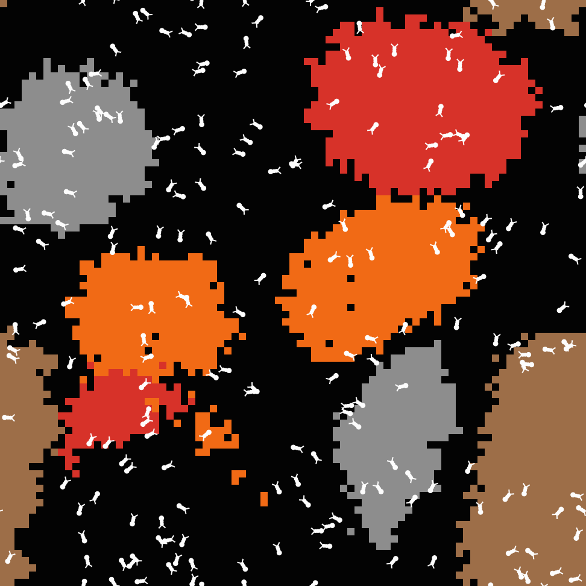

**Test 5**

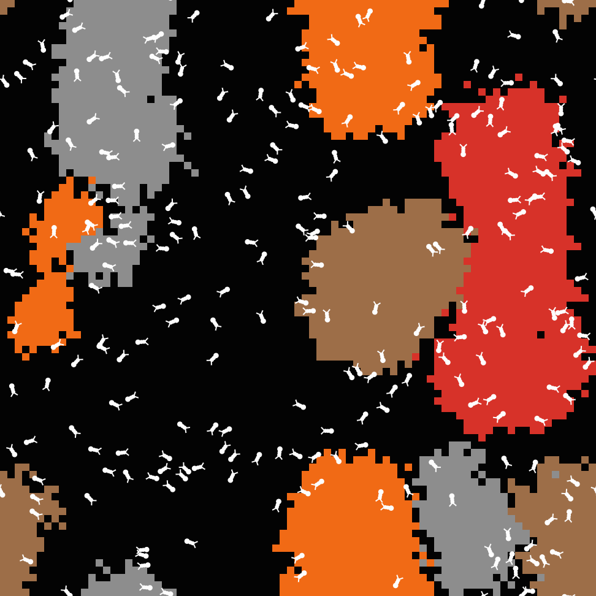

Можна помітити що чим більше термітів тим менше створюється маленьких куп, а відразу створюються великі.

### 2. Що буде, якщо взяти тільки одного терміта

Параметри системи, при яких здійснювалась симуляція:
- **number** - 1
- **density** - 15%
- **color** - 3

**Крок 1**

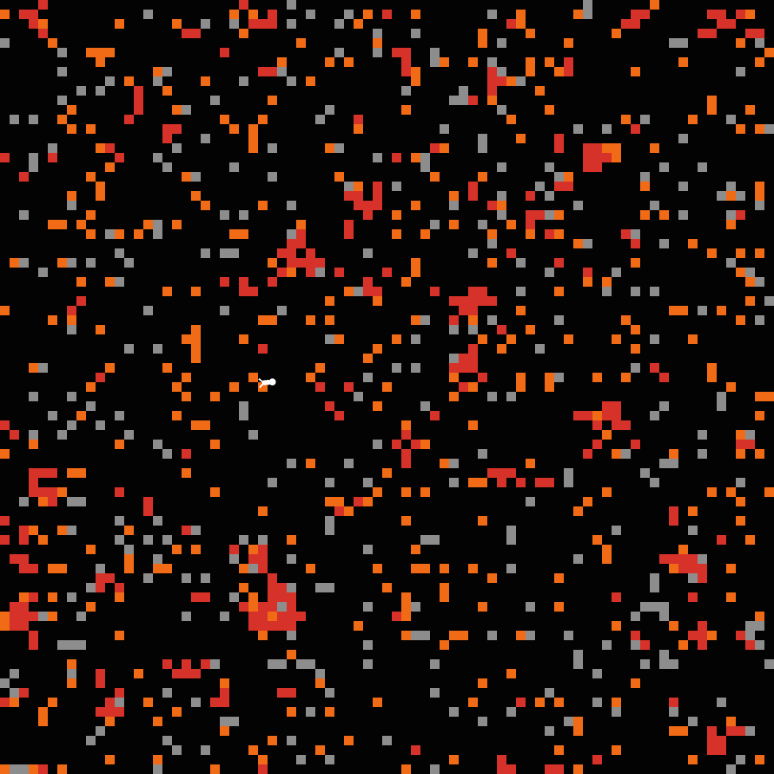

**Крок 2**

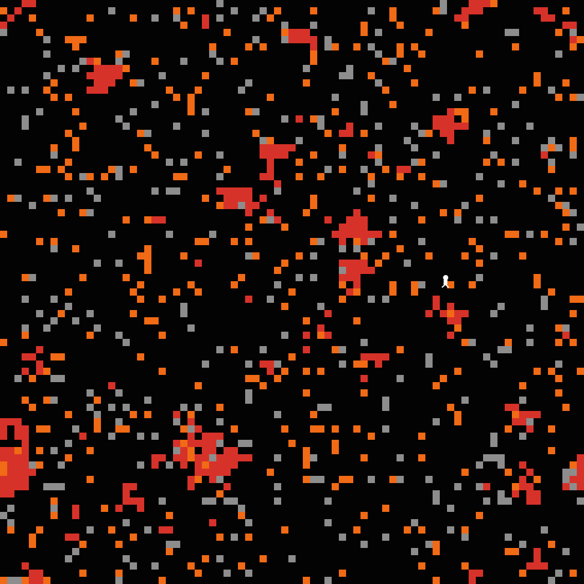

**Крок 3**

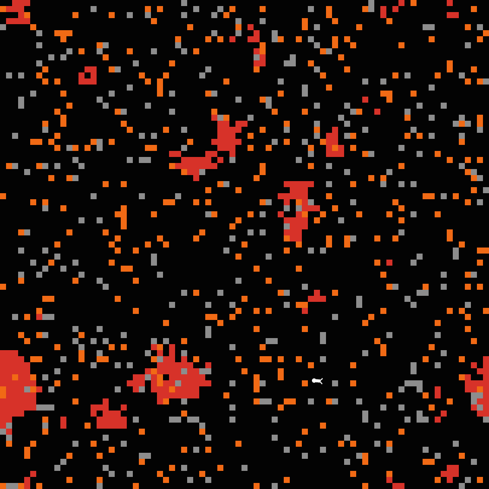

**Крок 4**

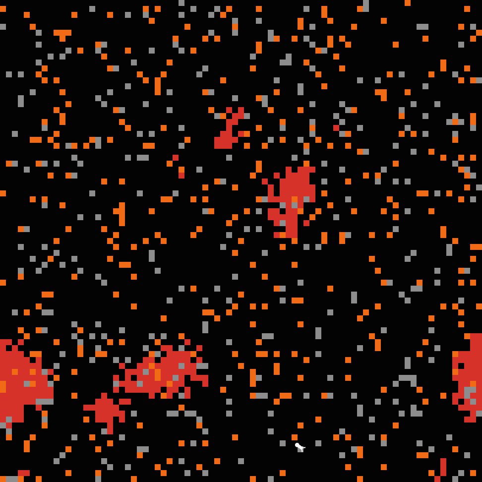

**Крок 5**

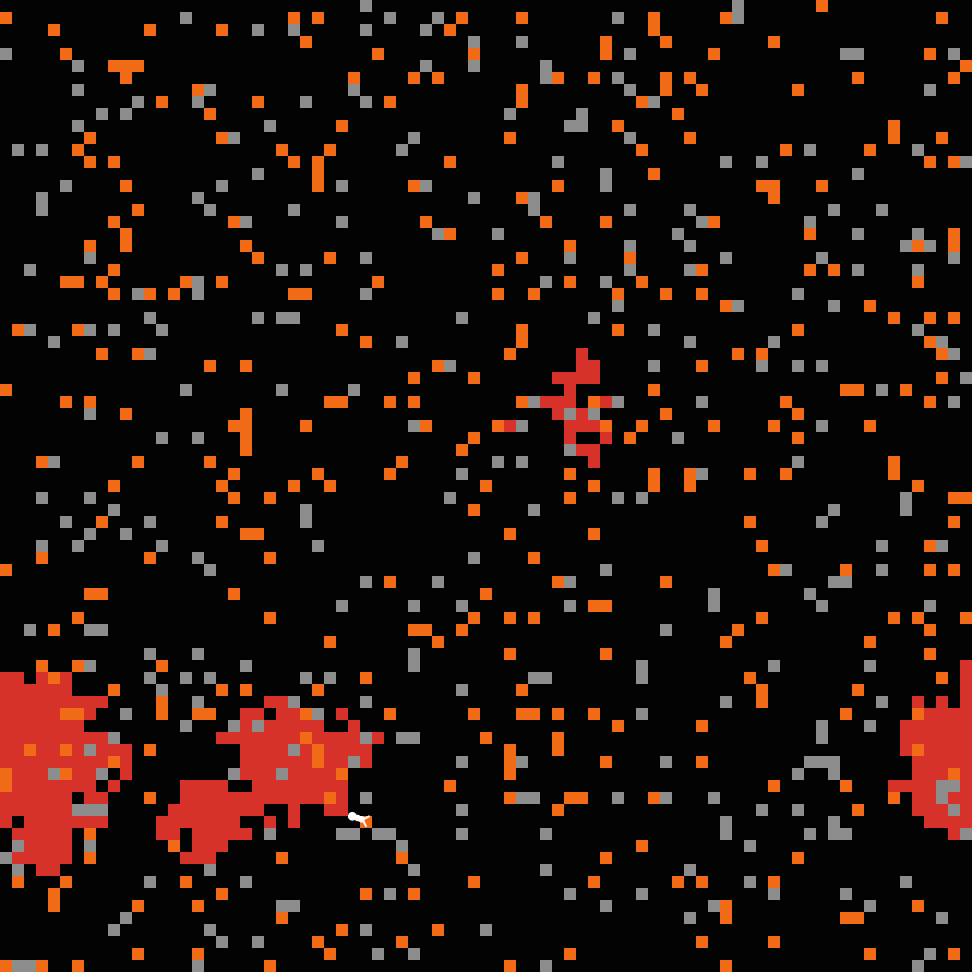

Можна помітити, що терміт спочатку формує маленькі купи, потім середнього розміру і потім великі. Стружку іншого кольору, він за визначенням, не чіпає.

### 3. Вплив початкової щільності деревної стружки

Трохи змінемо код, що можна було бачити тікі.

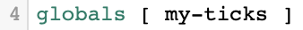

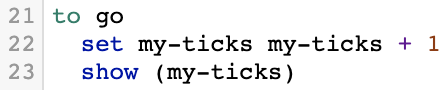

Та подивимось чи буде лінійна залежність. Експеримент при **density** від 1 до 5 з кроком 1 одиниця. Всього по 5 симуляцій для кожного **density**. Експеримент закінчується коли сформовано одну велику купу.

Інші параметри будуть фіксованими: 
- **number** - 1
- **color** - 1

**Тестовий прогін**

**Test 1**

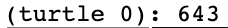

**Test 2**

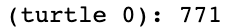

**Test 3**

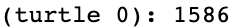

**Test 4**

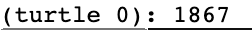

**Test 5**

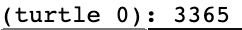

**Результати**

<table>
<thead>
<tr><th>density</th><th>середнє значення тіків</th></tr>
</thead>
<tbody>
<tr><td>1</td><td>404</td></tr>
<tr><td>2</td><td>1252</td></tr>
<tr><td>3</td><td>1627</td></tr>
<tr><td>4</td><td>2127</td></tr>
<tr><td>5</td><td>2826</td></tr>
</tbody>
</table>

Чіткої лінійної залежності не було підтверджено. Все залежить від того, як багато терміт створить куп на самому початку. Що більше, то довше.\
Можна помітити що між першим і другим експериментов різниця по часу ~ в 3 рази. А потім, третій експеримент ~ x4, четвертий ~ x5. На п'ятому експерименті залежність збилася і становить ~ x7.

 
