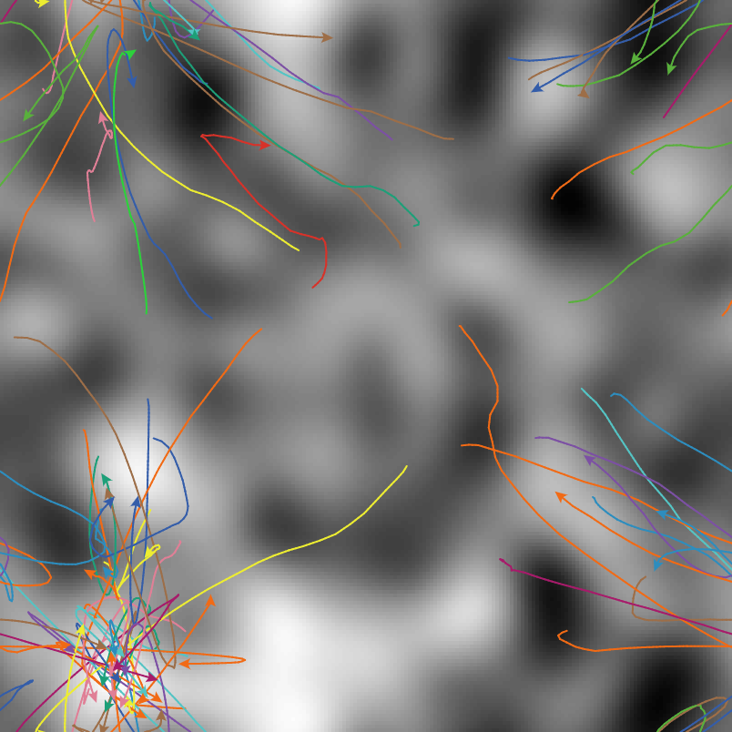

## Імітаційне моделювання комп'ютерних систем
## СПм-21-2, Бевзюк Роман Григорович
### Лабораторна робота №1. Опис імітаційних моделей
 

## Обрана модель в середовищі NetLogo:
[Particle Swarm Optimization](http://www.netlogoweb.org/launch#http://www.netlogoweb.org/assets/modelslib/Sample%20Models/Computer%20Science/Particle%20Swarm%20Optimization.nlogo)
 

### Вербальний опис моделі:
Particle Swarm Optimization (PSO) — це метод пошуку/оптимізації в галузі машинного навчання. Хоча PSO зазвичай використовується в просторах пошуку з багатьма вимірами, ця модель демонструє його використання в двовимірному просторі з метою легшої візуалізації.

Формально кажучи, існує деяка невідома функція f(x,y), і ми намагаємося знайти такі значення для x і y, щоб f(x,y) було максимальним. f(x,y) іноді називають функцією пристосування, оскільки вона визначає, наскільки добре поточне положення кожної частинки в просторі. Фітнес-функцію також іноді називають «фітнес-ландшафтом», оскільки він може складатися з багатьох долин і пагорбів.

Один із підходів (випадковий пошук) полягав би у випадковому виборі значень для x та y та записі найбільшого знайденого результату. Для багатьох пошукових просторів це неефективно, тому використовуються інші більш «розумні» методи пошуку. Оптимізація рою частинок є одним із таких методів. Частинки розміщуються в просторі пошуку та переміщуються в просторі за правилами, які враховують особисті знання кожної частинки та знання глобального «рою». Через свій рух частинки виявляють особливо високі значення f(x,y).

Кожна частинка має положення (xcor, ycor) у просторі пошуку та швидкість (vx, vy), з якою вона рухається через цей простір. Частинки мають певну інерцію, завдяки якій вони рухаються в тому ж напрямку, в якому вони рухалися раніше. Вони також мають прискорення (зміну швидкості), яке залежить від двох основних речей:
1) Кожна частинка притягується до найкращого місця, яке вона особисто знайшла (особистий рекорд) раніше за свою історію.
2) Кожна частинка притягується до найкращого місця, яке будь-яка частинка будь-коли знаходила (глобальне найкраще) у просторі пошуку.

Модель працює до тих пір, поки якась частинка в рої не знайде «справжнє» оптимальне значення (яке становить 1,00).

### Керуючі параметри:
- **landscape-smoothness** - наскільки плавним буде створюватися ландшафт.
- **population-size** - кількість використаних частинок.
- **particle-inertia** - величина, на яку частинки продовжують рухатися в тому самому напрямку, в якому вони були (на відміну від притягування силами тяжіння).
- **particle-speed-limit** - максимальна швидкість руху (у напрямках x або y) для кожної частинки.
- **attraction-to-personal-best** - сила тяжіння кожної частинки до місця, де вона раніше мала найвище значення (у власній історії).
- **attraction-to-global-best** - сила тяжіння кожної частинки до найкращого місця, коли-небудь виявленого будь-яким членом рою.
- **highlight-mode** - найкраще розташування будь-де в просторі пошуку ("True best") або найкраще місце, яке знайшов рій ("Best found").
- **trails-mode** - тип візуалізації для шляхів (слідів) частинок.

### Внутрішні параметри:
- **val**. Кожен патч має пов'язане з ним значення "придатності"
- **vx**. Швидкість в напрямку "x"
- **vy**. Швидкість в напрямку "y"
- **personal-best-val**. Найкраще персональне значення
- **personal-best-x**. Координата "x" найкращого персонального значення
- **personal-best-y**. Координата "y" найкращого персонального значення
- **global-best-x**. X координата найкращого значення, знайденого роєм
- **global-best-y**. Y координата найкращого значення, знайденого роєм
- **global-best-val**. Найвище значення, знайдене роєм
- **true-best-patch**. Patch з найкращим значенням

### Примітки:
Фактори, які треба враховувати при роботі з моделлю:\
Іноді рій швидко знаходить «ідеальне» (значення = 1,0) рішення, а іноді він «застрягає» не в тій області простору пошуку, і виглядає так, ніби він ніколи не знайде ідеального рішення. Ця ідея потрапляння в пастку поблизу «локального максимуму», коли десь у просторі пошуку є кращий «глобальний максимум», є поширеною проблемою, яка може виникнути в багатьох методах оптимізації (альпіністи, генетичні алгоритми, імітація відпалу). Один із варіантів алгоритму PSO використовує силу відштовхування між частинками, щоб утримувати їх у просторі, і менш імовірно, що всі тяжітимуть до неоптимального значення.

 

## Обчислювальні експерименти

### 1. Вплив плавності ландшафту на швидкість пошуку

Експеримент при **landscape-smoothness** від 0 до 100 з шагом 20 одиниць. Якщо пройшло більше 300 тіків, то симуляція завершується вручну і вважається що не було знайдено «справжнє» оптимальне значення.

Інші параметри будуть фіксованими: 
- **population-size** - 50
- **particle-inertia** - 0.98
- **particle-speed-limit** - 10
- **attraction-to-personal-best** - 2
- **attraction-to-global-best** - 1
- **trails-mode** - Traces

**Test 1**

Не було знайдено «справжнє» оптимальне значення.

**Test 2**

22 тіка уйшло на пошук

**Test 3**

Не було знайдено «справжнє» оптимальне значення.

**Test 4**

57 тіків уйшло на пошук

**Test 5**

Не було знайдено «справжнє» оптимальне значення.

**Test 6**

32 тіка уйшло на пошук

Можна помітити, що результати неоднозначні і складно встановити вплив ландшафту на швидкість пошуку.

### 2. Вплив мінімальної і максимальної плавності ландшафту на швидкість пошуку

Спробуємо вкотре визначити вплив плавності ландшафту на швидкість пошуку. Але тепер з мінімальним та максимальним значенням. 5 симуляцій при **landscape-smoothness** - 0 та стількі ж при **landscape-smoothness** - 0.

Інші параметри будуть фіксованими: 
- **population-size** - 50
- **particle-inertia** - 0.98
- **particle-speed-limit** - 10
- **attraction-to-personal-best** - 2
- **attraction-to-global-best** - 1
- **trails-mode** - Traces

**Test 1**

Не було знайдено «справжнє» оптимальне значення.

**Test 2**

Не було знайдено «справжнє» оптимальне значення.

**Test 3**

Не було знайдено «справжнє» оптимальне значення.

**Test 4**

Не було знайдено «справжнє» оптимальне значення.

**Test 5**

Не було знайдено «справжнє» оптимальне значення.

**Test 6**

237 тіків уйшло на пошук

**Test 7**

43 тіки уйшло на пошук

**Test 8**

39 тіків уйшло на пошук

**Test 9**

Не було знайдено «справжнє» оптимальне значення.

**Test 10**

153 тіки уйшло на пошук

Можна помітити, що при мінімальній плавності ландшафту – жодного разу не було знайдено «справжнє» оптимальне значення. При цьому, при максимальній плавності, тільки один раз не було знайдено, а всі інші рази знайшло.

### 3. Порівняння результатів персонального та глобального підходів

Дослідимо який із способів найбільш оптимальний. У разі "персонального" підходу **attraction-to-personal-best** - 2, **attraction-to-global-best** - 1. У разі "глобального" наоборот, **attraction-to-personal-best** - 1, **attraction-to-global-best** - 2. По 10 симуляцій для кожного підходу. Якщо пройшло більше 300 тіків, то симуляція завершується вручну і вважається що не було знайдено «справжнє» оптимальне значення.

Інші параметри будуть фіксованими:
- **landscape-smoothness** - 100 
- **population-size** - 50
- **particle-inertia** - 0.98
- **particle-speed-limit** - 10

<table>
<thead>
<tr><th>"Персональний" підхід(тіків)</th><th>"Глобальний" підхід(тіків)</th></tr>
</thead>
<tbody>
<tr><td>106</td><td>Не було знайдено «справжнє» оптимальне значення</td></tr>
<tr><td>33</td><td>12</td></tr>
<tr><td>21</td><td>19</td></tr>
<tr><td>Не було знайдено «справжнє» оптимальне значення</td><td>Не було знайдено «справжнє» оптимальне значення</td></tr>
<tr><td>133</td><td>31</td></tr>
<tr><td>43</td><td>Не було знайдено «справжнє» оптимальне значення</td></tr>
<tr><td>Не було знайдено «справжнє» оптимальне значення</td><td>11</td></tr>
<tr><td>42</td><td>34</td></tr>
<tr><td>44</td><td>28</td></tr>
<tr><td>94</td><td>Не було знайдено «справжнє» оптимальне значення</td></tr>
</tbody>
</table>

Швидкість пошуку серед усіх симуляцій – швидше у "глобальному" підході у 2.2 рази. Але при цьому і кількість "помилок" у 2 рази більше.

 