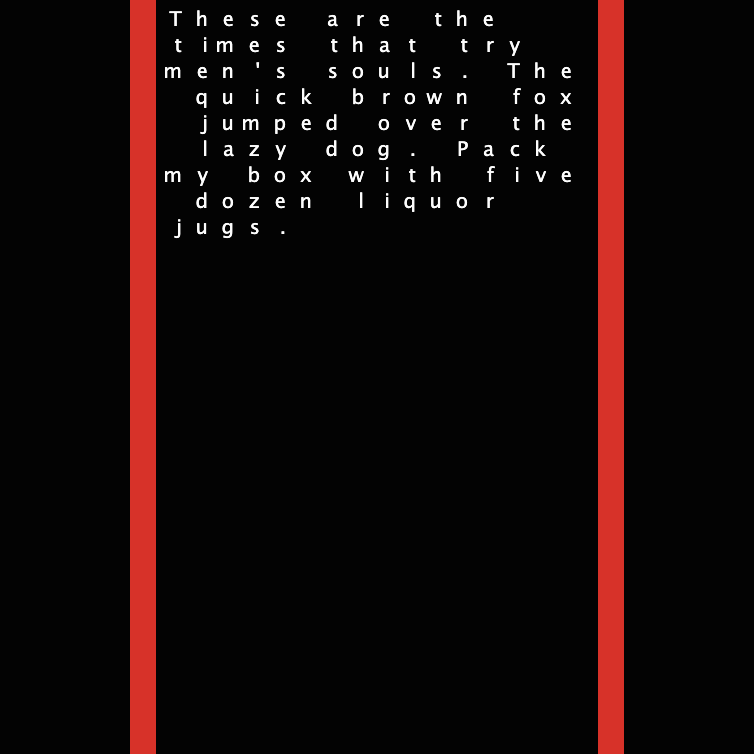

## Імітаційне моделювання комп'ютерних систем
## СПм-21-2, Бевзюк Роман Григорович
### Лабораторна робота №1. Опис імітаційних моделей
 

## Обрана модель в середовищі NetLogo:
[Wandering Letters](http://www.netlogoweb.org/launch#http://www.netlogoweb.org/assets/modelslib/Sample%20Models/Computer%20Science/Wandering%20Letters.nlogo)
 

### Вербальний опис моделі:
Wandering Letters — це модель яка ілюструє, як побудувати текстовий процесор, де кожна літера діє незалежно. Кожна літера знає лише те, яка буква стоїть перед нею та довжину її слова. Коли літери або поля переміщуються, літери самі знаходять шляхи назад у належне місце.

### Керуючі параметри:
- **Scatter Letters** - розкидає літери випадковим чином навколо View.
- **line-spacing** - скільки місця між рядками.
- **left-margin** - відступ зліва.
- **right-margin** - відступ справа.

### Внутрішні параметри:
- **text**. Змінна для зберігання тексту
- **left-edge**. X координата крайнього лівого стовпця, де можуть бути літери
- **right-edge**. X координата крайнього правого стовпця, де можуть бути літери
- **word-length**. Довжина слова
- **num-word**. Номер слова у тексті
- **leader**. Попередній символ перед поточним
- **new-line?**. Чи слід починати новий рядок чи ні

 

## Обчислювальні експерименти

### 1. Вплив місця між рядками на швидкість побудови тексту

Експеримент при **line-spacing** від 1 до 3 з кроком в 1 одиницю. Всього по 5 симуляцій для кожного значення **line-spacing**

Інші параметри будуть фіксованими: 
- **left-margin** - 5
- **right-margin** - 5

**Test 1.1**

**Test 2.1**

**Test 3.1**

<table>
<thead>
<tr><th>**line-spacing**</th><th>Середне значення(тіків)</th></tr>
</thead>
<tbody>
<tr><td>1</td><td>480</td></tr>
<tr><td>2</td><td>471</td></tr>
<tr><td>3</td><td>483</td></tr>
</tbody>
</table>

Значення схожі, проте при **line-spacing** - 2, швидкість складання тексту найшвидша.

### 2. Вплив відступів зліва та справа на швидкість побудови тексту

Експеримент при **left-margin**, **right-margin** від 1 до 5 з кроком в 1 одиницю. Всього по 5 симуляцій.

Інші параметри будуть фіксованими: 
- **line-spacing** - 2

**Test 1.1**

**Test 2.1**

**Test 3.1**

**Test 4.1**

**Test 5.1**

<table>
<thead>
<tr><th>**left-margin**, **right-margin**</th><th>Середне значення(тіків)</th></tr>
</thead>
<tbody>
<tr><td>1</td><td>462</td></tr>
<tr><td>2</td><td>460</td></tr>
<tr><td>3</td><td>439</td></tr>
<tr><td>4</td><td>324</td></tr>
<tr><td>5</td><td>487</td></tr>
</tbody>
</table>

Можна помітити, що при збільшенні відступів (іншими словами – менша довжина рядка) час формування тексту зменшувався. Але при значенні **left-margin** – 5, **right-margin** - 5, час різко збільшився і був найгірший результат.

 